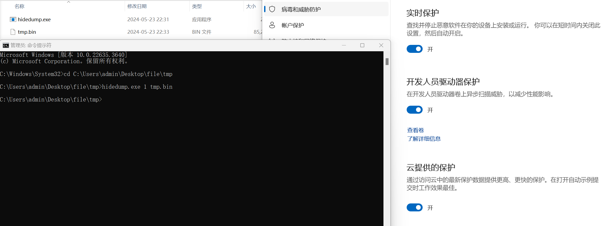

**Introduction**

```
Hidedump:a lsassdump tools that may bypass EDR
achieve：hook WriteAll+duplication
```


**Use**

```
hidedump.exe [opt] filename
opt==1:save the Encrypted dumpfile
opt==2:Decrypt the dumpfile and save the decrypted file as sec.dump

example
hidedump.exe 1 tmp.bin
hidedump.exe 2 tmp.bin
```




**More information**

```

```


**tip**

The project is no longer update for bypass, only to provide you with ideas